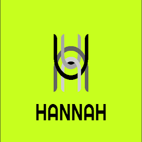

<p align="center">
  
</p>

<h1 align="center">HANNAH UI</h1>

<p align="center">
  Libreria de componentes React + Tailwind CSS para construir interfaces modernas y profesionales.
</p>

<p align="center">
  <strong>v0.0.3</strong> &middot; 49 componentes &middot; 9 filtros &middot; 6 templates
</p>

---

## Tabla de contenido

- [Sobre el proyecto](#sobre-el-proyecto)
- [Tech Stack](#tech-stack)
- [Requisitos previos](#requisitos-previos)
- [Instalacion](#instalacion)
- [Scripts disponibles](#scripts-disponibles)
- [Estructura del proyecto](#estructura-del-proyecto)
- [Componentes disponibles](#componentes-disponibles)
- [Templates](#templates)
- [Como usar en tu proyecto](#como-usar-en-tu-proyecto)
- [Storybook](#storybook)
- [Desarrollo](#desarrollo)
- [Build de la libreria](#build-de-la-libreria)
- [Dependencias opcionales](#dependencias-opcionales)

---

## Sobre el proyecto

**Hannah UI** nacio como un design system interno para estandarizar la UI de nuestros proyectos. La libreria empaqueta componentes reutilizables — desde un simple `Button` hasta un `DraggableTable` con columnas arrastrables y persistencia en localStorage — listos para usar con una sola importacion.

El proyecto se inicio con:

1. **Vite** como bundler en modo libreria (`lib mode`), generando un bundle ES Module + UMD.
2. **React 19** + **TypeScript** para tipado estricto.
3. **Tailwind CSS v4** para estilos utilitarios.
4. **Storybook 10** como playground de documentacion visual.
5. **Vitest** + **Testing Library** para testing.

---

## Tech Stack

| Herramienta | Version | Proposito |
|---|---|---|
| React | 19.x | UI framework |
| TypeScript | 5.9 | Tipado estatico |
| Vite | 7.x | Build tool (lib mode) |
| Tailwind CSS | 4.x | Estilos utilitarios |
| Storybook | 10.x | Documentacion visual de componentes |
| Vitest | 4.x | Testing unitario |
| Testing Library | 16.x | Testing de componentes React |
| ESLint | 9.x | Linting |
| Lucide React | 0.577 | Iconografia |

---

## Requisitos previos

- **Node.js** >= 18
- **npm** >= 9 (o pnpm/yarn)

---

## Instalacion

```bash
# Clonar el repositorio
git clone <url-del-repo>
cd Hannah-UI/hannah-ui

# Instalar dependencias
npm install
```

---

## Scripts disponibles

```bash
npm run dev              # Servidor de desarrollo Vite
npm run build            # Compilar TypeScript + build de la libreria
npm run test             # Ejecutar tests con Vitest
npm run test:watch       # Tests en modo watch
npm run test:coverage    # Tests con reporte de cobertura
npm run lint             # Linting con ESLint
npm run storybook        # Iniciar Storybook en modo desarrollo
npm run storybook:build  # Build estatico de Storybook
```

---

## Estructura del proyecto

```
hannah-ui/
├── .storybook/           # Configuracion de Storybook
├── public/               # Assets estaticos (logo, etc.)
├── src/
│   ├── components/       # Componentes de UI
│   │   ├── Alert/
│   │   ├── AppSelect/
│   │   ├── Avatar/
│   │   ├── Badge/
│   │   ├── Breadcrumb/
│   │   ├── Button/
│   │   ├── Card/
│   │   ├── Checkbox/
│   │   ├── Chip/
│   │   ├── ColorPicker/
│   │   ├── ConfirmModal/
│   │   ├── DatePicker/
│   │   ├── DraggableTable/
│   │   ├── ErrorMessage/
│   │   ├── ExpandableTable/
│   │   ├── ExportModal/
│   │   ├── FileDropzone/
│   │   ├── Filter/
│   │   ├── FilterPanel/
│   │   ├── Form/
│   │   ├── Header/
│   │   ├── HelpModal/
│   │   ├── Input/
│   │   ├── InteractiveCreditCard/
│   │   ├── KPICard/
│   │   ├── Login/
│   │   ├── Modal/
│   │   ├── NoteBanner/
│   │   ├── PageTabs/
│   │   ├── Pagination/
│   │   ├── PaymentMethodCard/
│   │   ├── PhoneInput/
│   │   ├── Radio/
│   │   ├── Register/
│   │   ├── SearchableSelect/
│   │   ├── Select/
│   │   ├── Sidebar/
│   │   ├── SimpleTable/
│   │   ├── Stack/
│   │   ├── StatsCard/
│   │   ├── StickyTable/
│   │   ├── Switch/
│   │   ├── Table/
│   │   ├── Tabs/
│   │   ├── Textarea/
│   │   ├── Toast/
│   │   └── Toggle/
│   ├── templates/        # Layouts y contextos reutilizables
│   │   ├── AppSidebar/
│   │   ├── AuthContext/
│   │   ├── DashboardLayout/
│   │   ├── ProtectedRoute/
│   │   ├── SidebarContext/
│   │   └── modulos/
│   ├── utils/            # Utilidades (cn, etc.)
│   ├── main.ts           # Entry point — todos los exports
│   ├── index.css         # Estilos base de Tailwind
│   └── Welcome.stories.tsx  # Pagina de bienvenida de Storybook
├── package.json
├── tsconfig.json
├── vite.config.ts
└── README.md
```

Cada componente sigue la estructura:

```
ComponentName/
├── ComponentName.tsx          # Componente principal
├── ComponentName.stories.tsx  # Historia de Storybook
├── ComponentName.test.tsx     # Tests (cuando aplica)
└── index.ts                   # Barrel export
```

---

## Componentes disponibles

### Formularios
| Componente | Descripcion |
|---|---|
| `Button` | Botones con variantes y estados |
| `Input` | Campos de texto con iconos |
| `Textarea` | Area de texto expandible |
| `Select` | Dropdown de seleccion nativo |
| `AppSelect` | Select searchable y creatable (react-select) |
| `SearchableSelect` | Combobox con busqueda (sin dependencias externas) |
| `Checkbox` | Casillas de verificacion |
| `Radio` / `RadioGroup` | Botones de radio |
| `Toggle` | Switch on/off |
| `Switch` | Toggle switch con label y descripcion |
| `DatePicker` | Selector de fecha con calendario propio |
| `ColorPicker` | Selector de color con presets |
| `PhoneInput` | Input de telefono internacional |
| `FileDropzone` | Upload con drag & drop y previsualizacion |
| `Form` / `FormGroup` / `FormDivider` | Contenedores de formulario |
| `ErrorMessage` | Mensaje de error inline |

### Datos y Display
| Componente | Descripcion |
|---|---|
| `Table` | Tabla basica con sorting y striped |
| `DraggableTable` | Tabla avanzada: drag & drop de columnas, resize, sorting multi-columna, minimizacion, paginacion, busqueda, pantalla completa |
| `ExpandableTable` | Tabla con filas expandibles |
| `StickyTable` | Tabla con columnas sticky (fijas) + scrollables |
| `SimpleTable` | Tabla ligera sin paginacion (TanStack) |
| `Card` / `CardHeader` / `CardBody` / `CardFooter` | Contenedor composable |
| `Badge` | Indicadores de estado |
| `Chip` | Tags removibles |
| `Avatar` / `AvatarGroup` | Fotos de usuario con grupo |
| `StatsCard` | Tarjetas de estadisticas con tendencia |
| `KPICard` | Tarjeta de indicador clave (KPI) |
| `Alert` | Mensajes contextuales |
| `NoteBanner` | Banner informativo con variantes |

### Navegacion
| Componente | Descripcion |
|---|---|
| `Header` | Barra superior |
| `Sidebar` | Menu lateral colapsable |
| `Tabs` | Pestanas con variantes |
| `PageTabs` | Tabs de navegacion por pagina con contadores |
| `Breadcrumb` | Rutas de navegacion |
| `Pagination` | Paginacion de datos |

### Overlays y Modales
| Componente | Descripcion |
|---|---|
| `Modal` | Dialogos modales |
| `ConfirmModal` | Modal de confirmacion (danger/warning/info) |
| `ExportModal` | Modal de exportacion (CSV/Excel/PDF/JSON) |
| `HelpModal` | Modal de ayuda con secciones tabuladas |
| `Toast` / `ToastProvider` | Notificaciones temporales |

### Filtros
| Componente | Descripcion |
|---|---|
| `FilterButton` | Boton con popover de filtros |
| `FilterSelect` | Dropdown filtrable |
| `FilterDate` / `FilterDateRange` | Selectores de fecha |
| `FilterSearch` | Busqueda con debounce |
| `FilterChips` | Multi-select con chips |
| `FilterBar` | Contenedor de filtros |
| `FilterPanel` | Popover de filtros con contador animado |
| `AdvancedTableFilter` | Filtros multi-campo con logica AND/OR |

### Templates y Paginas
| Componente | Descripcion |
|---|---|
| `Login` | Pagina de inicio de sesion |
| `Register` | Pagina de registro |
| `InteractiveCreditCard` | Tarjeta de credito 3D interactiva |
| `PaymentMethodCard` / `PaymentForm` | Selector de metodo de pago |

---

## Templates

Los templates son layouts y contextos de nivel superior para armar aplicaciones completas:

| Template | Descripcion |
|---|---|
| `DashboardLayout` | Layout completo de dashboard con sidebar colapsable, hover-expand y pin |
| `AppSidebar` | Sidebar pre-configurado con navegacion por categorias |
| `AuthProvider` / `useAuth` | Contexto de autenticacion |
| `SidebarProvider` / `useSidebar` | Contexto para controlar el sidebar |
| `ProtectedRoute` | Wrapper para rutas protegidas |
| `moduleCategories` | Definicion de modulos de navegacion |

---

## Como usar en tu proyecto

### 1. Instalar la libreria

```bash
npm install hannah-ui
```

Esto instalara **hannah-ui** junto con sus dependencias directas (`clsx`, `tailwind-merge`, `class-variance-authority`, etc.). Las dependencias opcionales (como `@tanstack/react-table` o `framer-motion`) **no se instalan automaticamente** — solo instalalas si usas los componentes que las requieren (ver [Dependencias opcionales](#dependencias-opcionales)).

> **Importante:** `react`, `react-dom` y `lucide-react` son **peerDependencies obligatorias**. Tu proyecto ya debe tenerlas instaladas. Si no las tienes:
>
> ```bash
> npm install react react-dom lucide-react
> ```

### 2. Importar estilos

Hannah UI incluye un archivo CSS con todos los estilos de Tailwind compilados. **Debes importarlo una sola vez** en el entry point de tu aplicacion:

```tsx
// main.tsx o App.tsx
import "hannah-ui/style.css";
```

> Sin esta importacion, los componentes se renderizaran sin estilos.

### 3. Usar componentes

```tsx
import { Button, Input, Card, CardHeader, CardBody, Alert } from "hannah-ui";

function App() {
  return (
    <Card>
      <CardHeader>
        <h2>Formulario de contacto</h2>
      </CardHeader>
      <CardBody>
        <Input placeholder="Tu nombre" leftIcon={<UserIcon />} />
        <Input placeholder="Tu email" type="email" />
        <Button variant="primary" size="md">
          Enviar
        </Button>
        <Alert variant="success">Mensaje enviado correctamente.</Alert>
      </CardBody>
    </Card>
  );
}
```

#### Ejemplo: Button con variantes

```tsx
import { Button } from "hannah-ui";
import { Save, Trash2, Plus } from "lucide-react";

function Buttons() {
  return (
    <>
      <Button variant="primary" leftIcon={<Save size={16} />}>Guardar</Button>
      <Button variant="danger" outline leftIcon={<Trash2 size={16} />}>Eliminar</Button>
      <Button variant="success" size="lg" loading loadingText="Creando...">Crear</Button>
      <Button variant="ghost" iconOnly><Plus size={16} /></Button>
    </>
  );
}
```

#### Ejemplo: Toast notifications

```tsx
import { ToastProvider, Toast, Button } from "hannah-ui";

function App() {
  return (
    <ToastProvider>
      <MiContenido />
    </ToastProvider>
  );
}
```

### 4. Usar un template de dashboard

Para aplicaciones completas, Hannah UI incluye templates de dashboard con sidebar, autenticacion y rutas protegidas:

```bash
# Instalar dependencias opcionales para templates
npm install react-router-dom
```

```tsx
import { DashboardLayout, AuthProvider } from "hannah-ui";
import type { ModuleCategory } from "hannah-ui";
import { Home, Users } from "lucide-react";

const categories: ModuleCategory[] = [
  {
    id: "general",
    title: "General",
    icon: Home,
    modules: [
      { id: 1, name: "Dashboard", path: "/dashboard", icon: Home, roles: ["ADMIN"] },
      { id: 2, name: "Usuarios", path: "/users", icon: Users, roles: ["ADMIN"] },
    ],
  },
];

function App() {
  return (
    <AuthProvider>
      <DashboardLayout
        sidebarProps={{
          user: currentUser,
          categories,
          onLogout: () => logout(),
        }}
      />
    </AuthProvider>
  );
}
```

### 5. Componentes avanzados (dependencias opcionales)

Si necesitas tablas avanzadas o componentes especializados, instala las dependencias correspondientes:

```bash
# Para DraggableTable, ExpandableTable, StickyTable, SimpleTable
npm install @tanstack/react-table

# Para DraggableTable (drag & drop de columnas)
npm install @dnd-kit/core @dnd-kit/sortable @dnd-kit/utilities

# Para AppSelect (select searchable)
npm install react-select

# Para FileDropzone (upload con drag & drop)
npm install react-dropzone
```

---

## Storybook

Storybook es la documentacion visual e interactiva de todos los componentes. Cada componente tiene stories que muestran sus variantes y estados.

```bash
# Iniciar Storybook en modo desarrollo
npm run storybook

# Build estatico (para deploy)
npm run storybook:build
```

Al abrir Storybook veras:

- **Welcome** — Dashboard con todas las tarjetas de componentes
- **Components/** — Cada componente con sus variantes interactivas
- **Templates/** — Layouts completos como DashboardLayout

Cada componente incluye:
- Documentacion automatica de props (generada desde JSDoc y TypeScript)
- Controles interactivos para probar variantes
- Codigo de ejemplo

---

## Desarrollo

### Agregar un nuevo componente

1. Crear la carpeta en `src/components/NuevoComponente/`
2. Crear los archivos:
   - `NuevoComponente.tsx` — Componente
   - `NuevoComponente.stories.tsx` — Stories de Storybook
   - `index.ts` — Barrel export
3. Agregar el export en `src/main.ts`
4. Agregar la tarjeta en `src/Welcome.stories.tsx`

### Convenciones

- **Estilos**: Tailwind CSS con la utilidad `cn()` para merge de clases
- **Iconos**: Lucide React
- **Tipado**: TypeScript estricto, exportar interfaces de props
- **JSDoc**: Documentar props con `/** */` para que Storybook las muestre
- **Colores de acento**: Amber como color primario del design system

---

## Build de la libreria

```bash
npm run build
```

Genera en `dist/`:
- `hannah-ui.js` — ES Module
- `hannah-ui.umd.cjs` — UMD bundle
- `hannah-ui.css` — Estilos CSS (Tailwind compilado)
- `main.d.ts` — Declaraciones de TypeScript

---

## Dependencias opcionales

La libreria tiene varias dependencias marcadas como **opcionales**. Solo necesitas instalarlas si usas el componente que las requiere:

| Dependencia | Componente que la usa |
|---|---|
| `@tanstack/react-table` | DraggableTable, ExpandableTable, StickyTable, SimpleTable |
| `@dnd-kit/core` + `@dnd-kit/sortable` + `@dnd-kit/utilities` | DraggableTable |
| `zustand` | DraggableTable, StickyTable (persistencia de estado) |
| `react-select` | AppSelect |
| `react-dropzone` | FileDropzone |
| `react-phone-number-input` | PhoneInput |
| `react-colorful` | ColorPicker |
| `framer-motion` | FilterPanel |

Los componentes base (Button, Input, Card, Table, Modal, etc.) **no requieren ninguna dependencia adicional** mas alla de React y Lucide React.

---

## Versiones

| Version | Descripcion |
|---|---|
| v0.0.3 | Se agregan 24 nuevos componentes portados desde BDApp-Frontend-V2 (tablas avanzadas, filtros, inputs especializados, modales) |
| v0.0.2 | Primera publicacion de prueba en npm |

---

<p align="center">
  <strong>HANNAH UI</strong> &middot; React + Tailwind CSS
</p>
